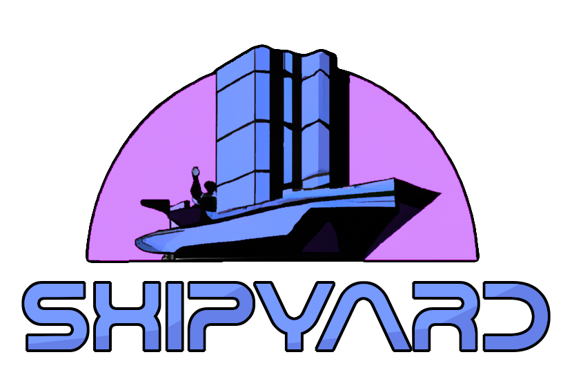

  

_quilt on steriods_  


Shipyard is a tool to help build and test patches against multiple versions of a source tree. It is
designed to aid management of multiple patches that apply to multiple versions of software.

## Getting Started

If you just want to make patch files, you can install the package normally

```
pip install "git+https://github.com/nullmonk/shipyard"
```

If you would like to build packages using [Dagger](https://dagger.io/) and docker, install the full tool

```
pip install "shipyard[all] @ git+https://github.com/nullmonk/shipyard"
```

## Documentation
Check out the [full documentation](https://nullmonk.github.io/Shipyard/) to get started using Shipyard


## Examples
Not many examples of repositories managed with Shipyard are open source, but [free-da](https://github.com/nullmonk/free-da) is one that makes exclusive use of
CodePatches to maintain source code
