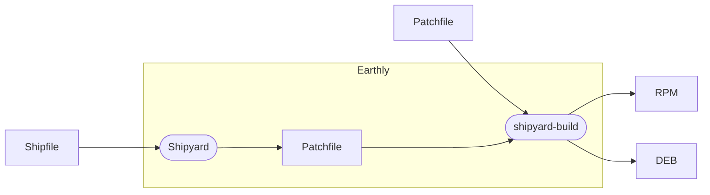

# Building
{: .no_toc }
<details open markdown="block">
  <summary>
    Table of contents
  </summary>
  {: .text-delta }
1. TOC
{:toc}
</details>

Despite shipyard primarily being used for generating patches, a tool `shipyard-build` is provided for building RPM and DEB packages with Shipyard. This system uses [Earthly](https://earthly.dev) and a single (albiet complicated) [Earthfile](../Earthfile) to allow easy building of packages using a single patch file or using a Shipfile.


## Earthly Build Process



{: .blue }

> For best results, set up an [Earthly satellite](https://docs.earthly.dev/earthly-cloud/satellites#getting-started) to improve build speed and save disk space


## Building from a Shipfile (auto version control)

The easiest way to build a package is using the shipfile directly. `shipyard-build` will attempt to
automatically detect the version and generate a patchfile based on it. This method has major advantages when using Code Patches.

{: .blue}
> If there are errors with the patch generation, it might be best to use the [Second method](#building-from-a-patch-file) for building.


If the Shipfile is fully self-contained (no patch files or included files), then only the Shipfile needs passed in to Earthly
```bash
earthly +build --image fedora:39 --package openssh-server --patch openssh/Shipfile.py
```

If the Shipfile uses traditional Patch files or includes other files, pass the entire diectory to Earthly
```bash
earthly +build --image fedora:39 --package openssh-server --patch openssh/
```

If some artifacts are not getting saved that need to be, you may use the `artifacts` flag to change which build artifacts are saved on disk

```bash
# Save all artifacts matching openssh*.rpm instead of just openssh-server*.rpm
earthly +build --image fedora:39 --package openssh-server --patch openssh/Shipfile.py --artifacts openssh
```

## Building from a Patch File

The Earthfile included can be used to build any patch file, even if it wasn't generated with Shipyard. 

Export the version that you would like to build via shipyard:
```bash
shipyard export v1.0 >> package.patch
```

Build the package with the custom patch file
```bash
earthly +build --image ubuntu:20.04 --package openssh-server --patch package.patch
```

## Troubleshooting the Build
When there are errors in the build process, you may hop into the container to check it out. Run the build job with `-i` enabled:

```bash
earthly -i +build --image ubuntu:latest --package openssh-server --patch shipfile.py
```

### Earthfile Arguments

| Argument | Required | Description |
| :-- | -- | :-- |
| `image` | ✅ | Docker image to build on. Only certain images are supported but some maybe be able to be added easily. |
| `package` | ✅ | The package to be patched and compiled against |
| `patch` | ✅ | The patch file or Shipfile to use for patching |
| `artifacts` | ❌ | Save build artifacts starting with this string. Defaults to `$package` |
| `export` | ❌ | Pass `true` or `yes` to export the built docker image for inspection of errors/tests |
| `dev` | ❌ | Install shipyard from the build context instead of from github |


### Supported Images

| Docker image | Type | Tested |
|:--|:--|:--|
| [`debian:12`](https://hub.docker.com/_/debian) | `deb` | ✅ Version > 9 |
| [`ubuntu:22.04`](https://hub.docker.com/_/ubuntu) | `deb` | ✅ Version > 16.04|
| [`centos:8`](https://hub.docker.com/_/centos) | `rpm` |  ✅ Version >= 7 |
| [`rockylinux:9`](https://hub.docker.com/_/rockylinux) | `rpm` |  ✅ Version >= 8 |
| [`fedora:39`](https://hub.docker.com/_/fedora) | `rpm` |  ✅ Version >= 38 |
| [`amazonlinux:39`](https://hub.docker.com/_/amazonlinux) | `rpm` | ❌ |
| [`linuxmintd/*:*`](https://hub.docker.com/u/linuxmintd) | `deb` | ❌ |
| [`kalilinux/*:*`](https://hub.docker.com/u/kalilinux) | `deb` | ❌ |
| [`archlinux:latest`](https://hub.docker.com/_/archlinux) | `pkg` | ❌ |


## Building many images at once
